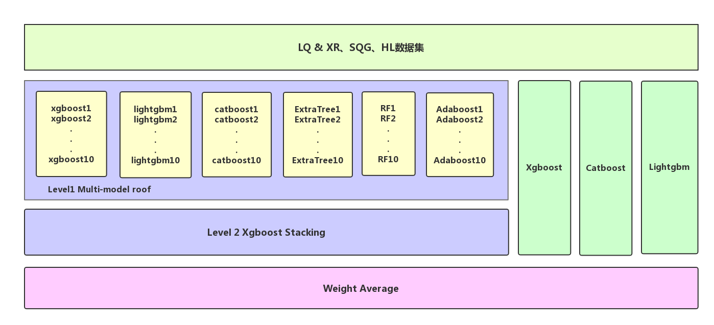

# Datacastle_Travel_Services_Predict

DataCastle 第二届智慧中国杯精品旅行服务成单预测解决方案。

- 单模型: xgboost A 榜 0.97329
- Stacking 和 Average: A 榜 0.97460 Rank7, B榜 0.97539 Rank 5

## How to run

1. 配置 Configure 文件
```python
base_path = '/d_2t/lq/competitions/data_castle/Datacastle_Travel_Services_Predict/'
# 数据清洗后的路径
cleaned_path = base_path + 'cleaned/'
# 生成的特征的路径
features_path = base_path + 'features/'
# 生成的模型可训练和预测的数据集
datasets_path = base_path + 'datasets/'
``` 
设置存放数据的根目录，并创建数据清洗 cleaned、生成的特征 features 和可训练预测的数据集 datasets 目录。

2. 执行根目录下的 `run.sh`
```bash
#!/usr/bin/env bash

# feature engineering
cd features
sh run.sh
cd ../model/

# run single model
python xgboost_model.py
python lightgbm_model.py
python catboost_model.py

# run model stacking
# ...
```

3. 执行 Stacking 

在 `model/ensemble` 下运行 `Stacking_Xgb_Param_Fine_Tuning.ipynb` 和 `Stacking.ipynb` 完成模型的 Stacking

4. 执行 Average

单模型和 stacking 结果保存到 `model/ensemble/average` 下，运行 `Weight_Average_Analyse.ipynb` 得到最终结果。

## Feature Engineering

1. User Profile: gen_user_features.py

- 性别是否缺失，性别 dummy code
- 用户所属省份进行 label encode
- 年龄段是否缺失，年龄段 dummy code

2. Order Comments

- 用户订单评分的统计特征
- 用户打分比例，最后一次打分
- 标签的基本统计特征

3. Order History: gen_order_history_features.py

- 最近的一次交易的 days_from_now, order_year, order_month, order_day, order_weekofyear, order_weekday
- 往前 90days 的计数特征，订单数量，去的城市的数量等
- 2016年和2017年去的城市数量，月份数量
- 用户总订单数、精品订单数以及精品订单比例
- 最后一次订单的城市、月份等所占比例
- 16年和17年月份的订单统计特征
- 是否是多次订单并且有精品的老用户
- 上一次交易到现在的时间差
- 交易的时间差的统计特征

4. APP Action: gen_user_action_features.py, gen_action_history_features.py 和 gen_advance_features.py

- 用户不同操作的购买率 × 9
- 每个月的 action 情况，最清闲的在几月，以及 action 的次数
- 最后一次 order 距离现在的 action 操作的次数
- 最后一次订单之后是否有支付操作和提交订单操作
- 距离最近的 action type 的时间距离 × 9
- 距离最近的倒数第二次 action type 的时间距离 × 9
- 点击 actiontype 的时间间隔统计特征 × 9
- 距离上一次 action type 操作到现在的统计特征 × 9
- 距离上一次 pay money 操作到现在 actiontype 的比例
- 最后1~20次的 actionType 和 时间戳，以及相邻操作的时间差
- 不同 actionType 的点击比例, 全局范围和倒数20次 2 × 9
- actionType1-5, 5-6, 7-8, 8-9的时间差小于timespanthred的数量
- 不同 actionType 出现的时间
- 最后一次 actionType1-5, 5-6, 6-7, 7-8, 5-7, 5-8 之间的间隔
- actionType 1-5, 1-6, 4-5, 5-6, 6-7, 5-8, 6-8 时间间隔统计特征
- 上述几个相似时间和时间差特征的统计特征
- 最后三次的 actionType 和时间的乘积
- 最近一个月距离现在的 action 操作的次数 × 9
- 用户操作 app 时间构成时间序列，对该序列进行离散傅里叶变换，取前三个实部分量
- 全局范围内同用户精品/总订单 VS 不同浏览量比值 2 × 9
- 距离上一次 order 到现在的 action type 的时间差的统计特征
- 最后一次点击APP开始浏览量
- action type 后的第一个操作的时间差的统计特征， 9 × 4
- 用户使用最频繁的一天使用 APP 距离现在的时间
- 对用户操作的 action 序列进行卡尔曼滤波，滤波之后的统计特征
- ~~用户操作 app 的波峰检测，波峰之间的时间差~~

5. 结合 Order 和 Action: gen_action_order_features.py

- 将精品和非精品看成 actiontype 为 10 和 11 的操作，合并 order history 和 action
- action 1-9 到 action 10 和 11 时间差的统计特征
- 2-gram 方式统计 5~9 先后出现的次数、比例和最后一次出现的时间，如：23, 34, 45, 等
- 3-gram 方式统计 5~9 先后出现的次数、比例和最后一次出现的时间，如：123, 234, 345, 等
- 2-gram 方式统计某种组合的时间统计特征，如：23, 34, 45, 等
- 3-gram 方式统计某种组合的时间统计特征，如：123, 234, 345, 等
- 用户actiontype序列转移的时间间隔，用户action序列1 3 5 2 7 4，计算1-3，3-5，5-2，7-4的时间转移间隔

特征工程运行时间较长，完整的特征文件下载传送门：[皇包车Rank5特征文件](https://pan.baidu.com/s/1ht7MjWg)

## Architecture


## License

This project is licensed under the terms of the MIT license.
